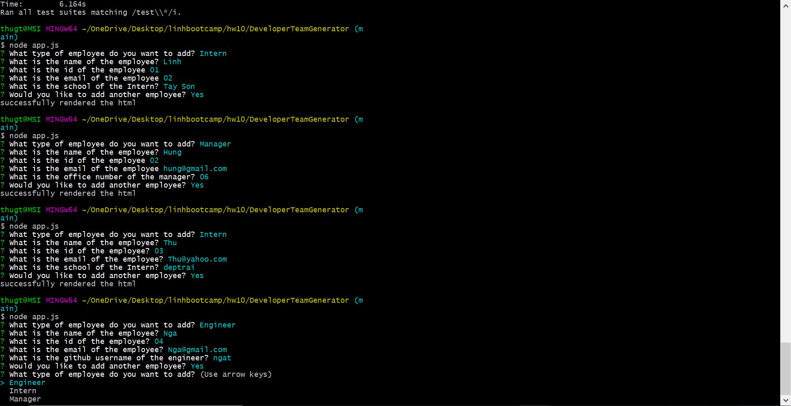

# DeveloperTeamGenerator

## Overview
This is a node CLI that takes in information about employees then renders it to HTML page. The information includes name of the employee, id of the employee and email of the employee. In addtion, there are 3 types of employees, and they are Engineer, Intern, Manager. Engineer has an additional information which is github username. Intern has a school name. Manager has office number

## How it works

Open the terminal and run:

`node app.js`

The CLI will start and a series of questions are displayed on the terminal. Answering the current question will lead to another question. Once all the questions are answered, depend on whether user wants to add another employee, an html page call "team.html" is created in the output folder. User can open up the html to view all the employees that have been entered

## Issues

Currently there are no major issues.

## Development

The visual of the rendered page is being updated

## Technologies

